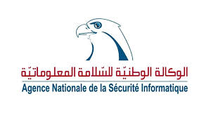

The Open Web Application Security Project (OWASP) is a nonprofit foundation that works to improve the security of software. All of our projects ,tools, documents, forums, and chapters are free and open to anyone interested in improving application security. 

The chapter Leader is  [Nihel Ben Youssef](nihel.benyoussef@owasp.org). Follow chapter news on  [Facebook](https://www.facebook.com/OWASP.Tunisia.Chapter.Official) ,   [Linkedin](https://www.linkedin.com/groups/8591169/)

### Meeting Sponsors
The following is the list of organisations who have generously provided us with space for OWASP Tunisia chapter meetings.
Thank you for your contribution.

### Partners
The following is the list of organisations/Foundations who have generously help us to communicate about OWASP projects and OWASP Tunisia chapter activities. Thank you for your contribution.

|

<!---->

### Speaking at OWASP Tunisia Chapter Events
If you would like to present a talk on Application Security at future OWASP Tunisia Chapter events - please review and agree with the [OWASP Speaker Agreement](https://www.owasp.org/index.php/Speaker_Agreement) and send the proposed talk title, abstract and speaker bio to the Chapter Leader via e-mail: nihel.benyoussef (at) owasp.org
Please mention in email's subject : Tunisia Speaker request-your name 

###  Event/meeting TICKETS!
All events/meetings are free to attend for both members and non-members of OWASP and are open to anyone interested in application security and cyber security. Please note that for our future events, you MUST REGISTER to book your place and get a ticket to be admitted to the event - your name will be checked against the guest list. Please note that generally the space are limited, so please only book tickets if you are able to attend!

###  Current Actions

####  National Survey about Software Security Awarness
Afin de mieux cibler ses actions futures (cours/moyens/long termes) , OWASP Tunisia chapter mène une compagne de sondage  à l'échelle nationale sur la sensibilisation à la sécurité des logiciels (Software Security ).  

Merci de remplir ce   [Formulaire ](https://docs.google.com/forms/d/e/1FAIpQLSdhYuzbZvAeD5hyTikGkLMUVfPDuTEZuH10qx48zfzF7KFBug/viewform)(2 min à remplir) est destiné aux: 
 * Professionnels/Développeurs/Experts(Etablissement privée/publique) qui travaillent dans le domaine du Software
 * Universitaires enseignant les cours de développement(Coding et génie logiciel...) 
 * Etudiants/nouveau diplômés ayant un cursus en Software

Cette compagne s'aligne avec les actions ciblées par la stratégie nationale de Cybersécurité annoncée officiellement le 9 décembre 2019.
Nous comptons sur votre participation et sur la diffusion à votre échelle!

### Next Action

Participation of OWASP Tunisia Chapter to the National Security Day SecuriDay April 2020 with SecuriNets Foundation. 

Suivez nous sur [Facebook](https://www.facebook.com/OWASP.Tunisia.Chapter.Official) et  [Linkedin](https://www.linkedin.com/groups/8591169/)
