## Past Events

**2019-11-16**. Local OWASP Tunisia Chapter Meeting.Cercle des bureaux. Centre Urbain Nord. Tunis. Thanks for Axians Cybersecurity for Hosting the event

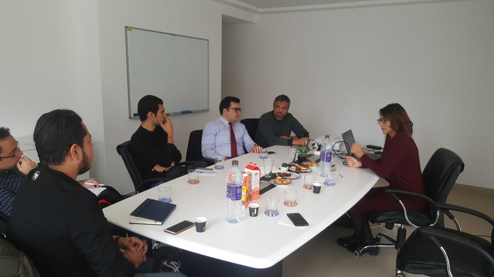|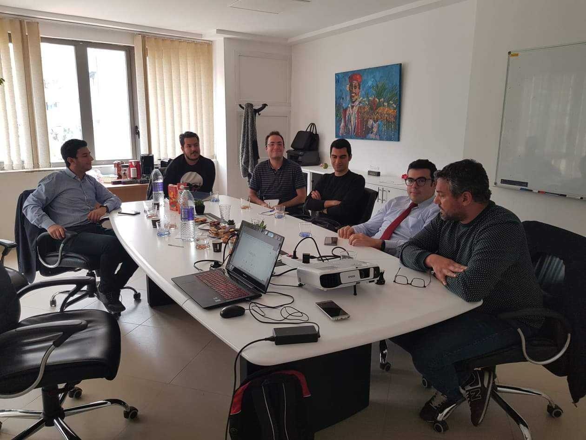

**2019-04-14** Participation of OWASP Tunisia Chapter, SecuriDay2K19 Event : National Security Day. Privacy and Personal Data Protection. With SecuriNets Foundation . INSAT.Tunis.

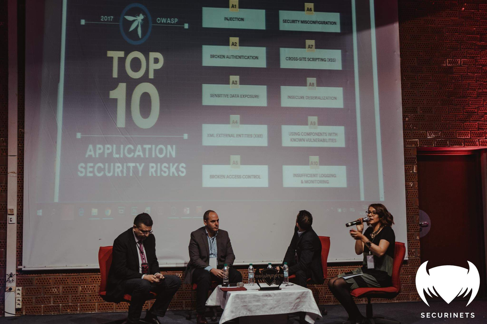|
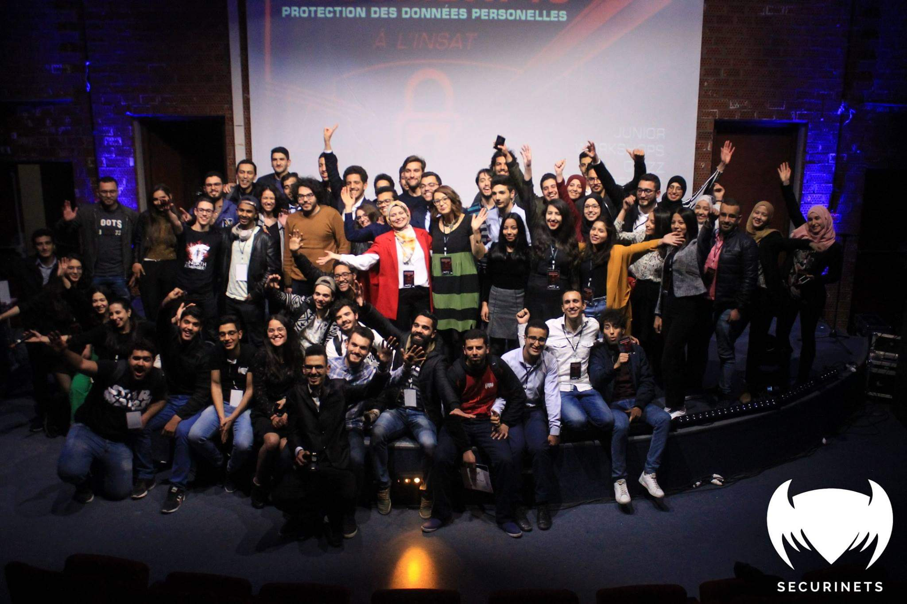|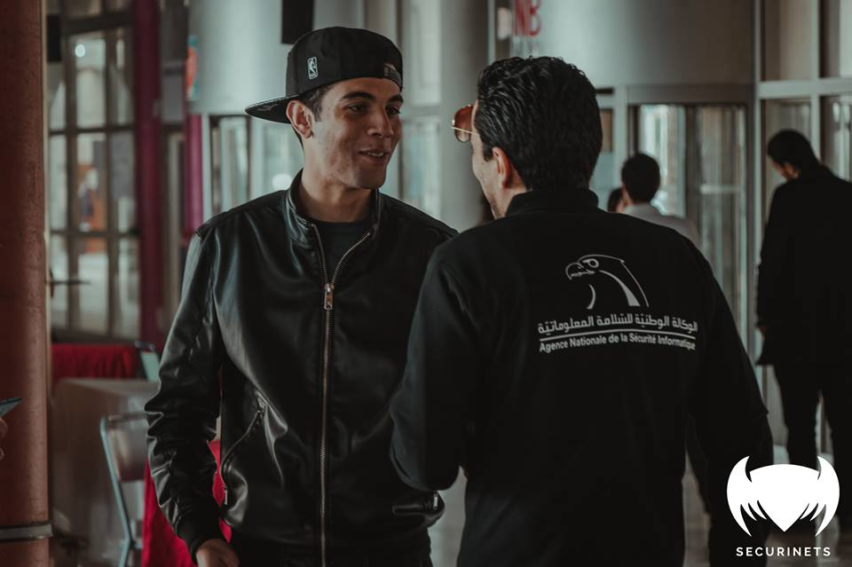

**2019-02-23** : Participation of OWASP Tunisia Chapter, "The art of DevSecOps" Event with SecuriNets Foundation: Presentation of OWASP DevSecOps projects.@ SecurinetsISI Acropolium de Carthage. Tunis. Speaker: Raouf Mnif DevOps Engineer, Futura Digital

|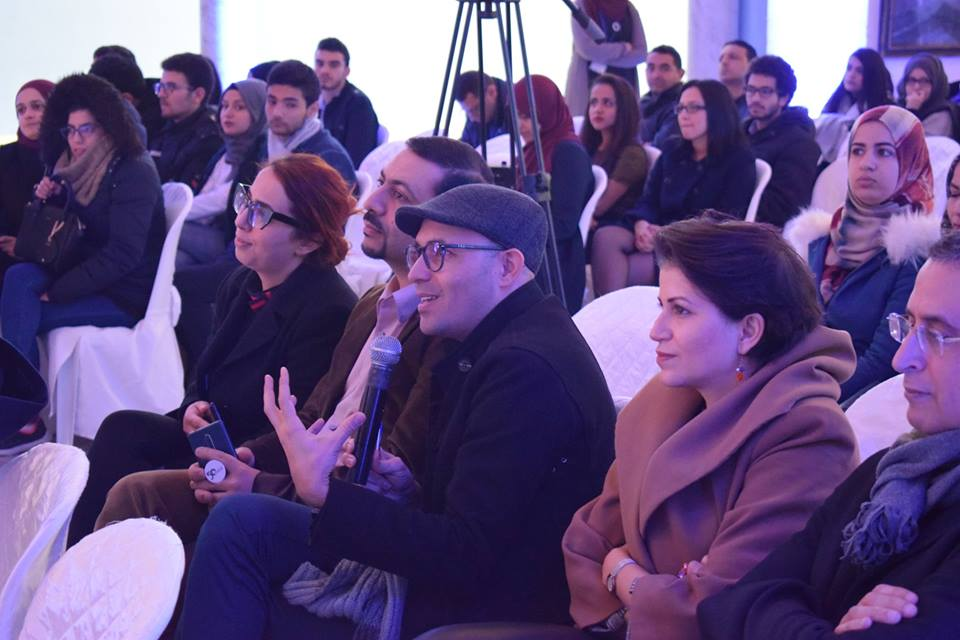
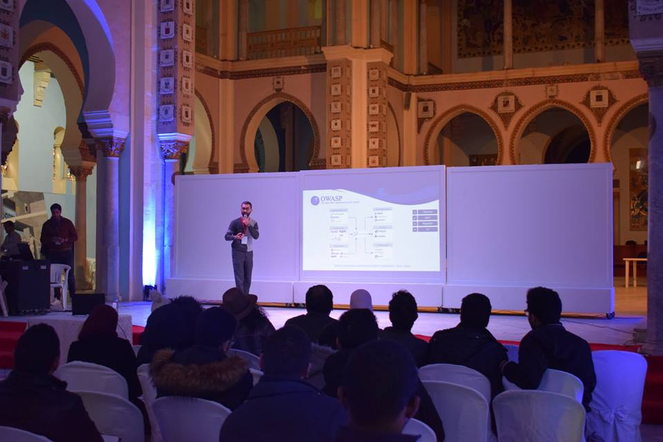|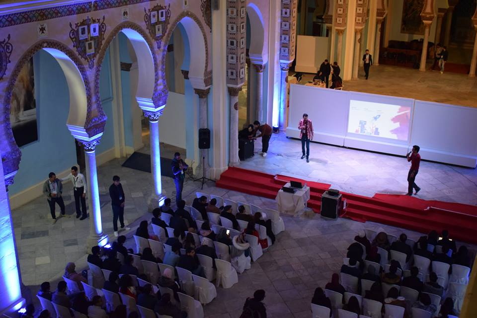

**2018-06-29** : OWASP Tunisia Chapter, Workshop on OWASP IOT PROJECT and Demo : Exploiting Command injection Vulnerability in firmware using Firmware analysis Tool, Firmadyne, binwalk) and OWASP ZAP : Carthage Cyber Arena CCA 2018 @Arena Lac (Guest Lecture). Speaker: Nihel Ben Youssef. OWASP Tunisia Chapter leader.

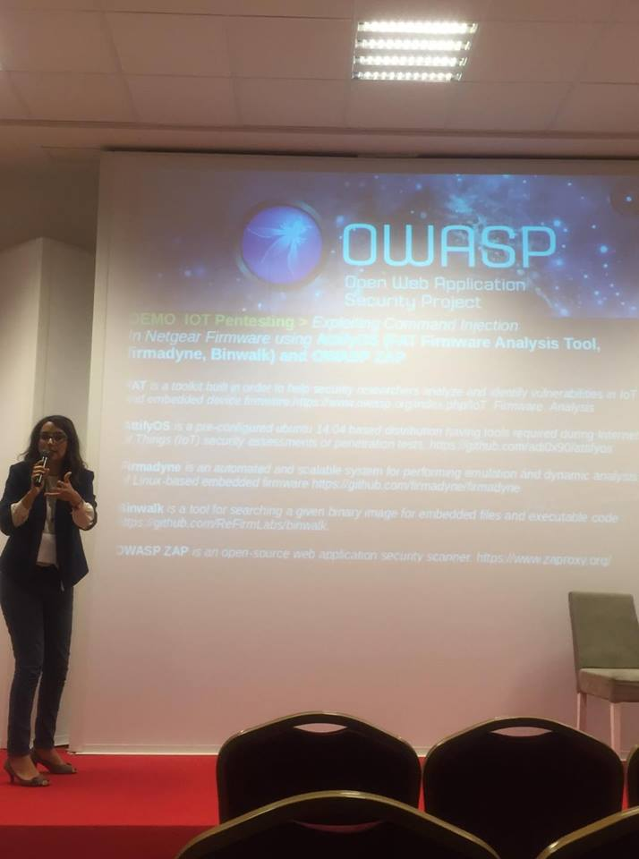|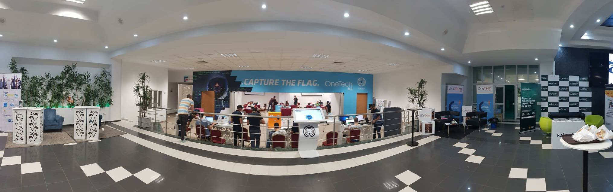

**2018-03-08** : Workshop on Big DATA Security and OWASP NoSQL injection Demo: Hackathon BigDATA @FSJEG (Guest Lecture). Speaker: Nihel Ben Youssef. OWASP Tunisia Chapter leader.

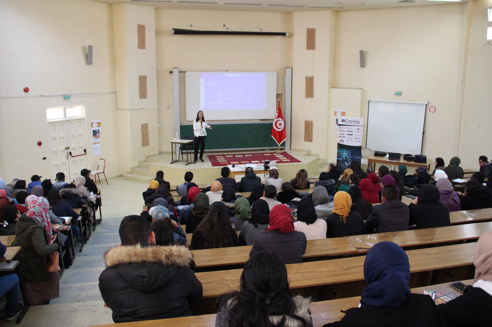|

***2018-03-03**: Presentation of OWASP Foundation and OWASP Tunisia Chapter: Ebanking CyberSecurity Event organized by SECURINETS_ISI @Pôle El Ghazela (Guest Lecture)

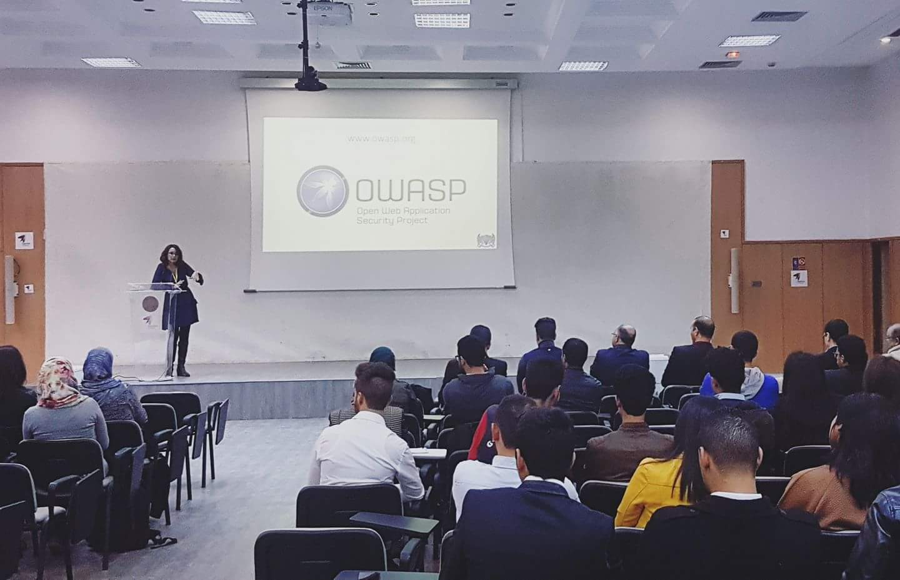

**2017-04-06 : Workshop: Introduction to the OWASP Top 10 Mobile Security Risks @ISET RADESBy Abdessabour Arous, Past OWASP Tunisia Chapter**

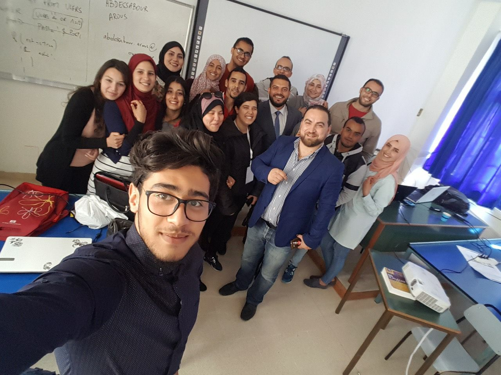|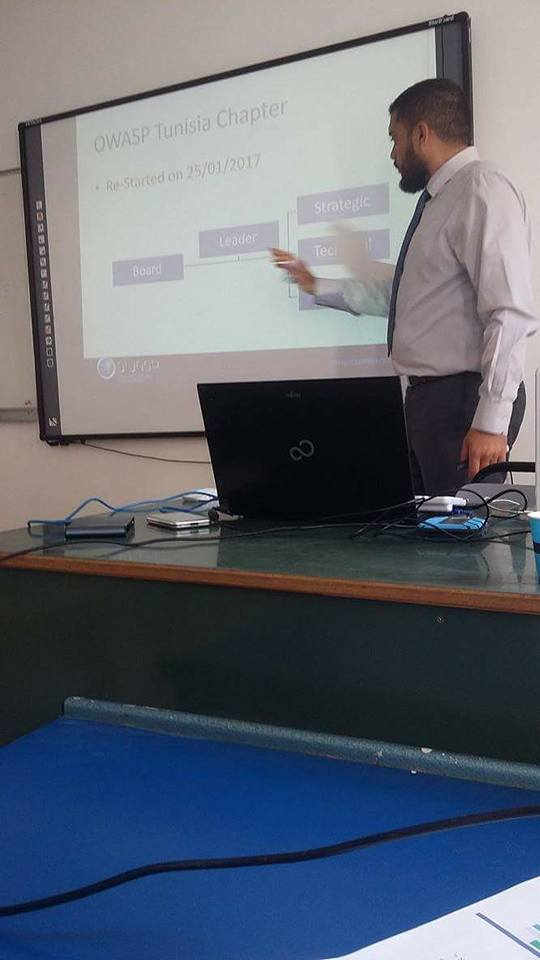

**2017-03-08**: Workshop: Introduction to the OWASP Top 10 IoT Security Risks @SECURINETS ISI

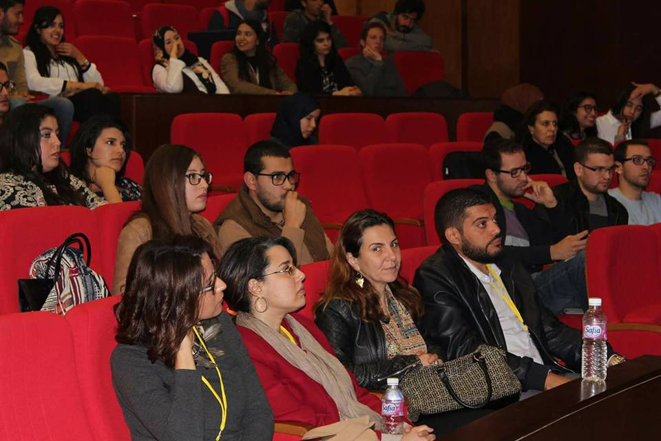|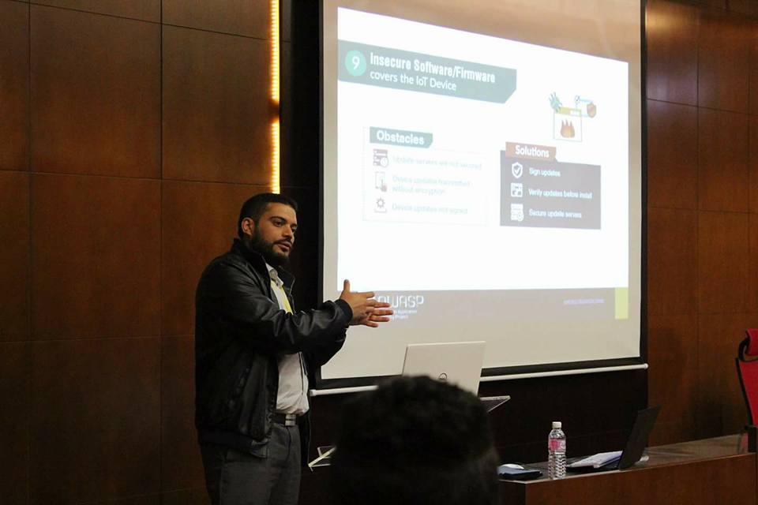

**2017-02-19** : OWASP Tunisia Chapter, "Project Zero" Project Meetup

**2017-02-16**: OWASP Tunisia Chapter contributed to the Rounde Table: "Table Ronde sur la sécurité de l'information" @UIT - Université Internatioanle de Tunis

